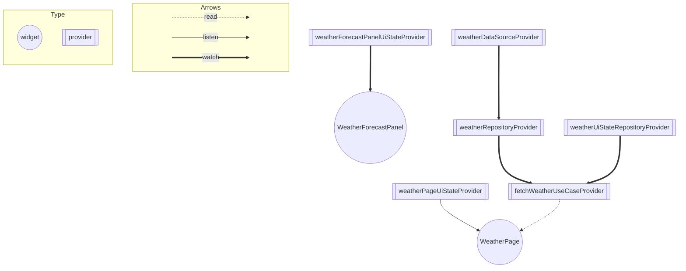

# 状態管理を見直す

`setState` や `InheritedWidget` をそのまま用いる方法は、階層が深くなってしまったり、コード量が多くなってしまったりなどの課題があるため、[Riverpod]
などの外部パッケージを利用する人が多いのではないでしょうか。

Flutter での状態管理の方法について、公式からいくつか紹介されています。

- [List of state management approaches]

その中で [Provider] が紹介されていますが、[Provider] にあったいくつかの課題を解決した改良版が [Riverpod] です。

[Riverpod] を導入して、状態管理やアーキテクチャを見直してみましょう。

## 課題

- [Riverpod] を導入して、天気予報画面の状態管理を見直す
- アーキテクチャを見直し、ARCHITECTURE.md に記載する

## ヒント

[Different Types of Providers] に Provider の種類とそれぞれの違いがまとめられています。

Provider の依存関係図の例：

※ この Provider の依存関係図は [riverpod_graph] を利用して自動生成しました。

## 参考資料

- [Flutterの状態管理手法の選定]
- [【2021年版】Flutterの状態管理パターン総まとめ]

<!-- Links -->

[List of state management approaches]: https://docs.flutter.dev/development/data-and-backend/state-mgmt/options

[Provider]: https://pub.dev/packages/provider

[Riverpod]: https://pub.dev/packages/riverpod

[Different Types of Providers]: https://riverpod.dev/docs/concepts/providers/#different-types-of-providers

[riverpod_graph]: https://github.com/rrousselGit/riverpod/tree/master/packages/riverpod_graph

[Flutterの状態管理手法の選定]: https://medium.com/flutter-jp/state-1daa7fd66b94

[【2021年版】Flutterの状態管理パターン総まとめ]: https://qiita.com/datake914/items/f91acf30a640447c57c8
